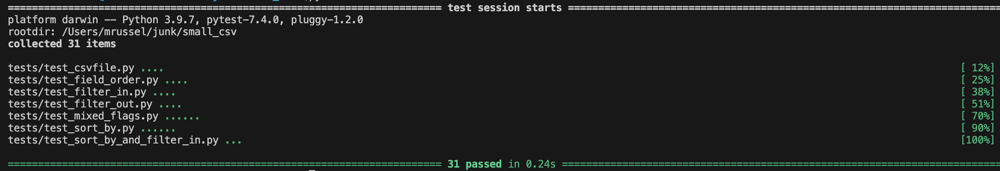

## Small CSV
Small CSV filter created in python [test code]

## Usage
```
usage: main.py [-h] [--sort_by SORT_BY] [--filter_in FILTER_IN] [--filter_out FILTER_OUT] [--field_order FIELD_ORDER] csv_file

Sort based on a given column.

positional arguments:
  csv_file              Path to the CSV file

optional arguments:
  -h, --help            show this help message and exit
  --sort_by SORT_BY     Column to sort by (Single value)
  --filter_in FILTER_IN
                        Show only requested columns (Comma seperated)
  --filter_out FILTER_OUT
                        Show all columns except mentioned columns (Comma seperated)
  --field_order FIELD_ORDER
                        Helps ordering the column (Comma seperated)
```

### --sort_by
The csv file will be sorted as per given column, It follows alphanumeric sorting order. For the severity field, it order from low to high, If invalid value provided in this field, it will be ignored

### --filter_in
Only requested columns will be displayed, It has higher priority than --filter_out field, Comma seperated values can be given as value as well as single column name also can be given. If invalid column name provided, It will raise error. If same column is provided in both flag, --filter_in will be considered 

### --filter_out
All the the fields except the columns provided in the filter_out field will be displayed. As same as filter_in comma seperated values can be given as value as well as single column name also can be given. If invalid column name provided, It will raise error, If same column value provided in both filter_out and filter_in flags filter_out will not be considered

### --field_order
The columns will be shown in the order of given in the --field_order. Any invalid column names will raise errors, *It will not filter values as --filter_in and --filter_out.* if not all available columns mentions in this flag, the mentioned columns will be moved to left (first), after that unmentioned columns will be moved(right). If filtered column name is given, it will simply ignore it

Test Cases: 
Total 31 testcases added




